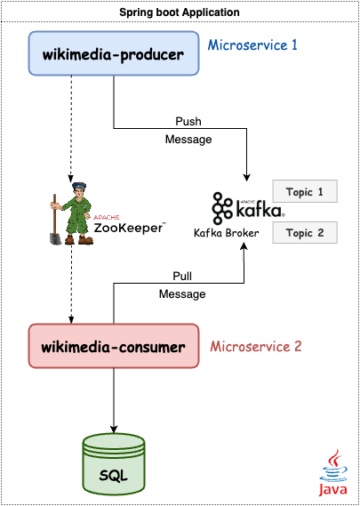
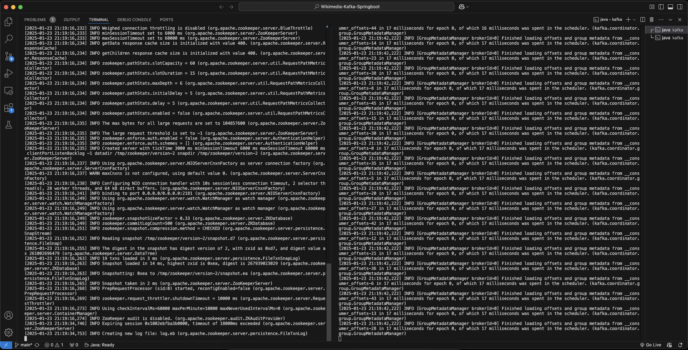
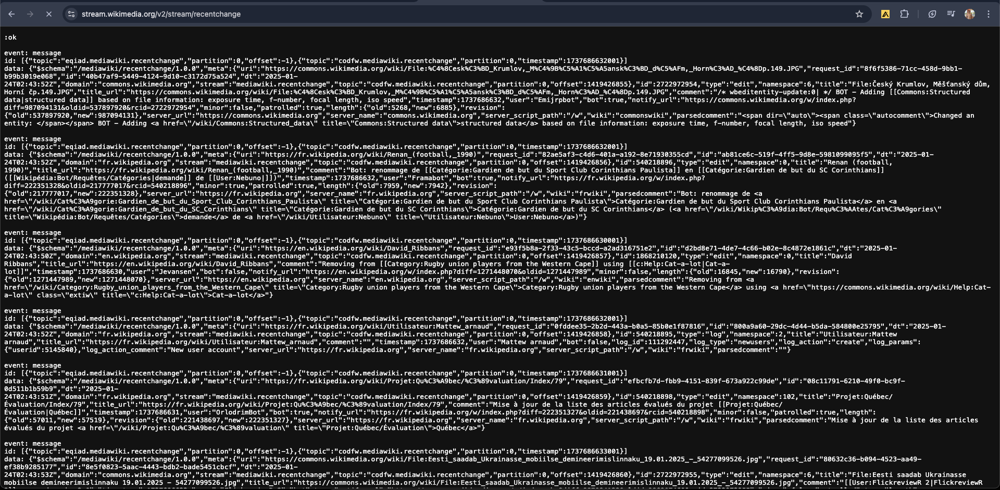
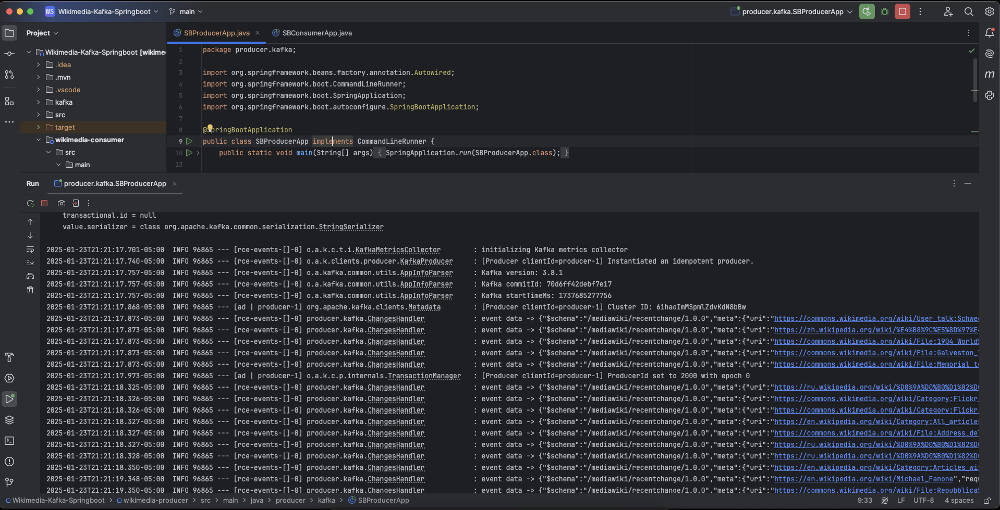
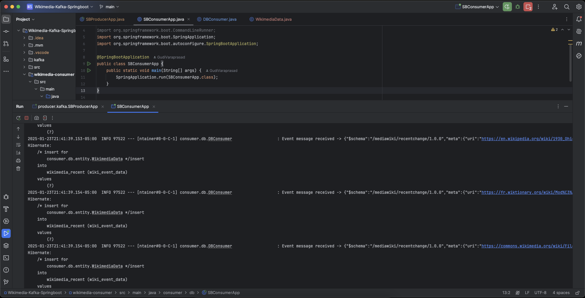
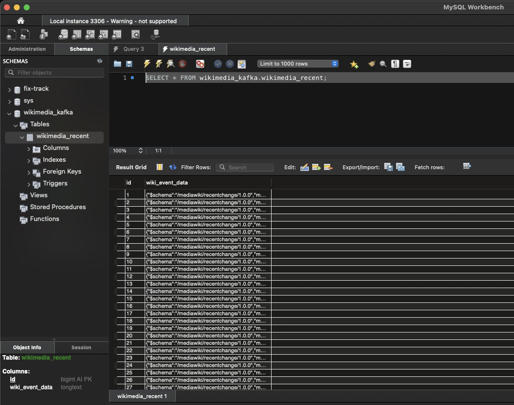

# 🏗️ Wikimedia Streaming Spring Boot Application



This project explores a classic Producer-Consumer problem and showcases a real-time data streaming pipeline using **Spring Boot** and **Apache Kafka**. The application captures live Wikimedia updates, streams them through Kafka, and stores the wikimedia events data in an **SQL database** for future analysis.

## 🌟 Application Design

This system follows a **producer-consumer architecture**:

📤 **Producer Microservice**:
- Connects to [Wikimedia EventStream API](https://stream.wikimedia.org/v2/stream/recentchange)
- Streams live events to a Kafka broker via a dedicated topic.

📥 **Consumer Microservice**:
- Listens to Kafka topics.
- Processes the events and stores them in an **SQL database**.


📚 **Data Pipeline**:
- 🛠️ **Apache ZooKeeper** manages the Kafka cluster.
- 📦 **Apache Kafka** ensures reliable message delivery.
- ☕ **Java** powers the producer and consumer microservices with efficient multithreading and robust performance.
- 🌱 **Spring Boot Framework** simplifies the development of microservices, offering seamless integration with Kafka and MySQL.
- 🛢️ **MySQL database** stores the events for further use.

## 🚀 How to Run

Follow these steps to set up and run the application:

1. Clone the repository:
   ```bash
   git clone https://github.com/GudiVaraprasad/Wikimedia-Kafka-Springboot.git
   cd Wikimedia-Kafka-Springboot
   ```

2. Start **ZooKeeper**:
   ```bash
   cd kafka
   bin/zookeeper-server-start.sh config/zookeeper.properties
   ```

3. In a new terminal, start **Apache Kafka**:
   ```bash
   cd kafka
   bin/kafka-server-start.sh config/server.properties
   ```

4. (Optional) Test Kafka topics with the console consumer:
   ```bash
   bin/kafka-console-consumer.sh --topic wikimedia_recent --from-beginning --bootstrap-server localhost:9092
   ```

5. Start the **MySQL server**:
   ```bash
   mysql.server start
   ```

6. Run the **Producer Microservice**:
   Open the file `SBProducerApp.java` and run it. You’ll see Wikimedia data being pushed to the Kafka broker.

7. Run the **Consumer Microservice**:
   Open the file `SBConsumerApp.java` and run it. The consumer microservice will pull events from the Kafka topic and store them in the MySQL database.

---

## 🎉 Output Snapshots

### ✅ Starting ZooKeeper and Kafka


### 📡 Wikimedia Data Source


### 🛠️ Producer Microservice


### 🗃️ Consumer Microservice


### 📊 MySQL Database Storage


## 🔮 Features

- **Real-Time Streaming**: Live event capture from Wikimedia.
- **Decoupled Architecture**: Producer and Consumer services for scalability.
- **Persistent Storage**: Store events in SQL for further analysis.


## 🌟 Future Enhancements

- Add monitoring tools like **Grafana** or **Prometheus**.
- Implement REST APIs to query and visualize stored data.


## 🤝 Contributions

Contributions are welcome! Submit a pull request or open an issue to get started.